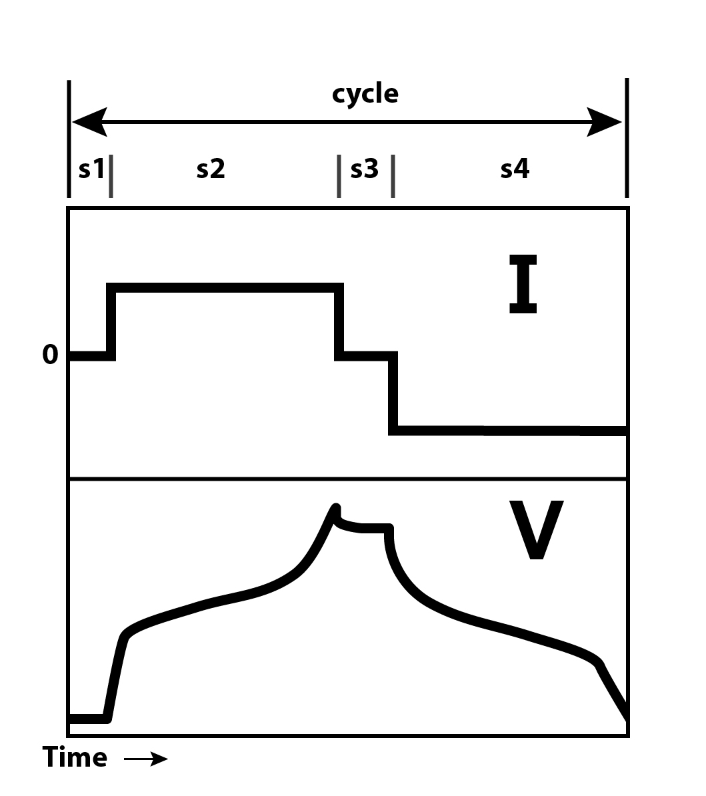

# Summary

Recent years have witnessed an exponential increase in battery research, driven by the need to develop efficient and sustainable energy storage systems. One of the main tools in battery research are battery cycling experiments, providing deep insights into performance lifetime and quality of the battery. Due to the large variety of battery testing equipment and the resulting multitude of different and often proprietary data formats, combined with the large number of parameters involved, managing and processing battery testing data has often been a difficult and tedious task.

The python library `cellpy` aims to assist in elevating these problems by

1. providing the possibility to read different data formats,
2. converting those into one common data format that also includes relevant battery-specific meta-data, and
3. providing a data structure equiped with a set of methods that helps the user to easily perform simple and in-depth analysis of both single data sets and collections of data sets.

# Statement of need

The python library `cellpy` provides powerful and versatile tools for the simple and efficient handling of battery testing data originating from different battery cell testers.

Typically, a battery-testing data set consists of time series data with voltage ($V$), current ($I$) and capacity ($Q$). Most cell cycling instruments provide these data in a format which is straightforward to plot and adjust, e.g., to the weight of the battery (gravimetric capacity) or its size (volumetric capacity). However, cell tests often contain a lot of other information which can be extracted with reference to additional parameters, such as e.g., charge rate, response time and in some cases external information like cell temperature. Looking more closely at the data allows to gain a deeper understanding of the battery.

The most common way of structuring battery data is to split the time series data into so-called battery cycles (charge & discharge). Each cycle usually consists of several steps, where for example the current can be constant in one step, and zero in the next step. \autoref{fig:1} illustrates a typical data set containing one full cycle (“cycle”) consisting of four steps (“s1” to “s4”). By looking at specific cycles or steps, the battery researcher can for example interpret how the internal resistance in the battery develops over time or infer something about the internal kinetics in the battery cell.

Unfortunately, different brands of instrument handle the digital information in different ways and store it in different formats. To compare many cells tested under different conditions and with a large variety of additional meta-data (type of cell, type of chemistry, electrode properties, etc.), more advanced data handling methodologies are required. One of the important steps in most data handling is homogenizing the data-pulling together information from multiple sources and ensuring that it is consistent, accurate and comparable. This alone can be a challenging task.
`cellpy` aims to assist in this task: `cellpy` can directly parse the data from most commercial battery testing units, as well as reading user defined text and spreadsheet formats. It converts and saves the data in a common format so that subsequent data handling becomes considerably easier. As well as translating to the common format, `cellpy` has a range of utilities for studying the data, including: extraction of key characteristics from the tests, calculation of derivatives, cell comparison, plotting and statistical analysis.

The main intended audience for `cellpy` were battery researchers who primarily worked on developing new materials for batteries and were performing tests of their materials in what could be labelled as laboratory-scale battery cells. As the adaption of `cellpy` increased, the library gradually evolved into a more full-fledge solution for reading, processing, and analysing battery test data, with added tools such as performing incremental-capacity analysis (dQ/dV) [@2022dub,@2023spi] and batch processing of results from many battery tests [ref ?].
There are currently several open-source libraries focusing on battery test-data extraction. However, most of them are dedicated to specific battery testing equipment: notably galvani [@galvani] parses the proprietary format used by [BioLogics](https://www.biologic.net/), neware_reader [@neware_reader] parses several versions of the data from [Neware](https://newarebattery.com/) and galv (formerly Galvanalyser) [@galv] supporting Maccor, Ivium and Biologic formats. BEEP (Battery Evaluation and Early Prediction [@beep]) is a set of tools designed to support battery evaluation and early prediction of cycle life providing a structured interphase for collecting and processing battery test data exported to text format. In this space, `cellpy` excels with its ability to effortlessly import and process the data through a simple API, while still giving the user fine-grained control of the behaviour through setting parameters, applying hooks, or directly using a more advanced “deeper” API. Furthermore, `cellpy` supports several common battery test instruments and formats, in addition to offering full flexibility by allowing the user to provide other file format specifications (in YAML format).

`cellpy` functions as an excellent starting point for researchers leaning towards advanced analysis, since it can automatically convert data with different units, summarize and perform statistical evaluations all the way down to the individual cycle step level. This eases further use of the data e.g., as features for machine learning algorithms. `cellpy` also promotes reproducibility and traceability throughout the entire process through e.g., the implementation of a templating system. With a myriad of battery testers in the market, data uniformity has often been elusive. `cellpy` addresses this by offering a standardized format that accommodates data from diverse battery testers. More importantly, the `cellpy` data format is not just a mere data container, but thoughtfully embeds battery-specific metadata, which often proves invaluable in interpreting and comparing results across tests and conditions.

# Implementation and architecture

`cellpy` is implemented in python and can be used as either a library within python scripts, or as a stand-alone application for analysing battery cell test data. Internally, `cellpy` utilises the rich ecosystem of scientific tools available for python. In particular, `cellpy` uses pandas DataFrames as the “storage containers” for the collected data within the `cellpy` Data object. This offers full flexibility and makes it easy for the user to apply advanced methods, analyses or transformations of and to the data in addition to the features implemented in `cellpy`.

The core of `cellpy` is the CellpyCell object (\autoref{fig:2}). This object contains the important and central methods required to read and process the data. Additional classes and methods are used by CellpyCell, such as different readers for importing data in different formats.

Each CellpyCell object contains a Data object storing both, the battery test data as well as the corresponding meta data (\autoref{fig:3}). The `cellpy`-file format (usually stored in hdf5 format) contains all the data contained in the Data object together with additional relevant meta data such as information about the file version.

The `cellpy` library also consists of a rich set of utilities (\autoref{fig:4}) that can be used for further processing the data, both individually and in batch routines.

# Acknowledgements

The development of `cellpy` was supported by the following projects: "KPN Silicon on the Road" Research Council of Norway (RCN), project number xxxx, , "KSP MoreIsLess", RCN project number XXX, "SiBEC", "SIMBA", "SecondLife", "MoZEES", "LongLife",

The authors are thankful to the noumerous inputs and comments from our collegueas and collaborators, and in particular Dr. Preben J.S. Vie.

# References